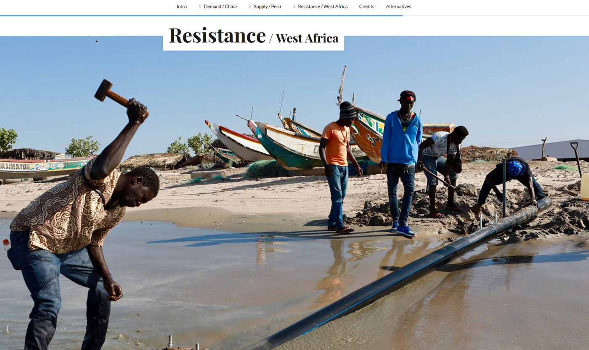
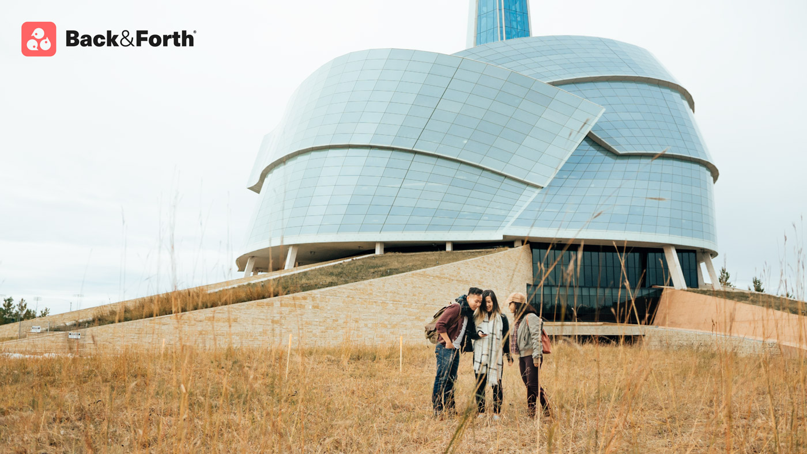
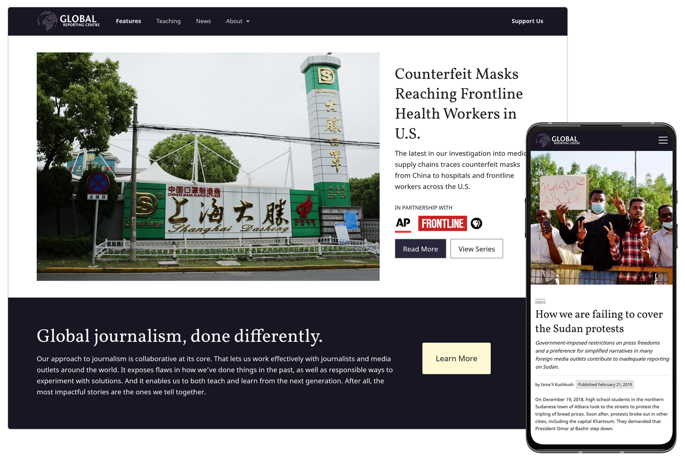
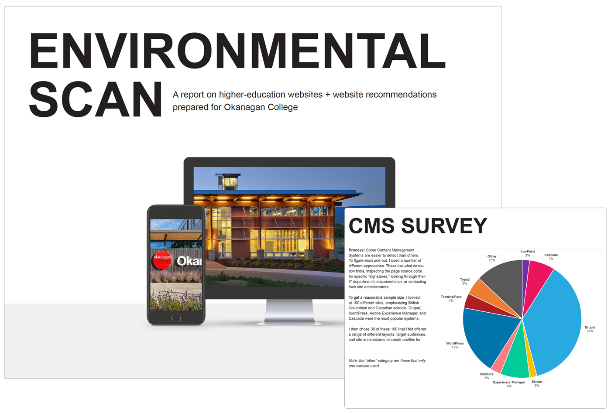

<section>
    

        

          
        

        

          <h2>The Fish You (Don't Know You) Eat</h2>
          
          <h3>design + development</h3>
          
Students, faculty, and journalists travelled to China, Peru and West Africa—key locations in the global fishmeal industry—to investigate its true costs. Published in partnership with <em>NBC News</em>. View the <a href="https://globalreportingprogram.org/fishmeal">project website</a> or <a href="https://www.nbcnews.com/nightly-news/video/the-fish-you-don-t-know-you-eat-part-1-70090821824">NBC segment</a>.

        

    

</section>
<section>
    

        

            <h2>Back & Forth</h2>
            <h3>Management + Writing + Design</h3>
            
An open-source platform to deliver team-based, real-world interactive experiences. I managed this project from its inception, raised funds, and built partnerships with organizations like the City of Vancouver and the Stanley Park Ecology Society. I also lead writing and gameplay design for its first use case: a satirical, team-based apocalypse training game called <em>Apocalypse Made Easy!</em> designed to teach people about emergency preparedness. View the <a href="https://globalrepcentre.github.io/back-and-forth/">project website</a> or <a href="https://github.com/GlobalRepCentre/back-and-forth">GitHub repo</a>.

        

        

          <figure>
            
            <figcaption>Photo by <a href="https://twitter.com/jonjournalism">Jonathan Ventura</a>. Branding + Web by <a href="https://plantaflag.com/en">Plant a Flag</a>.</figcaption>
          </figure>
        

    

</section>
<section>
    

        

            <figure>
                
            </figure>
        

        

            <h2>Global Reporting Centre</h2>
            <h3>Design + Development + Writing</h3>
            
The Global Reporting Centre is a non-profit media organization based at the University of British Columbia. I designed and developed a WordPress theme in consultation with staff and the advisory board, including customizations to the admin interface to make updating and publishing to the site easier. Check out the <a href="https://globalreportingcentre.org">website</a> or <a href="https://github.com/GlobalRepCentre/grp-wordpress-theme">GitHub repo</a>.

        

    

</section>
<section>
    

        

            <h2>Okanagan College</h2>
            <h3>Writing + Development</h3>
            
I helped plan the redevelopment of Okanagan College's website, which included producing a detailed environmental scan and report, assisting with stakeholder coordination and in-person feedback sessions, and creating a custom web-based testing tool. The tool incorporated timed randomized tasks for users to perform as well as A/B testing.

        

        

          
        

    

</section>